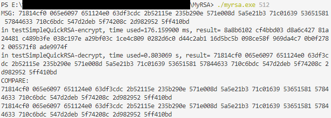
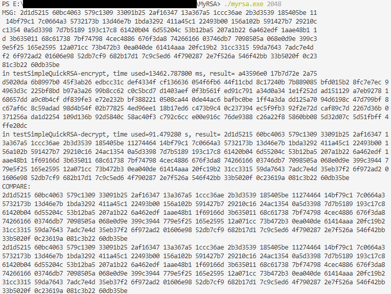
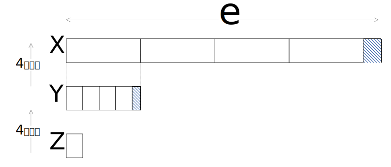

<center>

# MyRSA 程序代码文档
</center>

**<center>yayi2456</center>**


**Myrsa作为本程序的一个分支存在，这是并行和密码两个课的代码的一个共同的仓库**，关于MontgomeryMe的说明，参见`thesis.pdf`。


本程序实现一了一个RSA密码器，
能够在给定密钥长度的情况下使用对应长度的密钥对随机生成的消息进行加解密操作。


## 编译与运行

本代码使用$\verb| mingw32-gcc-g++ |$编译器进行编译链接和可执行文件生成。
如需重新编译代码，运行$\verb|./runme.bat|$。
文件$\verb|runme.bat|$中的内容如下：
```win
del *.o
del myrsa.exe
g++ -O2 -c main.cpp -o main.o
g++ -c simpleBigint.cpp simpleModexp.cpp quickModexp.cpp layersModexp.cpp simpleMontgomery.cpp myRSA.cpp crtRSA.cpp main.cpp
g++ -o myrsa main.o myRSA.o crtRSA.o simpleMontgomery.o layersModexp.o quickModexp.o simpleModexp.o simpleBigint.o
```
文件$\verb| runme.bat |$首先删除所有目标文件和可执行文件，
随后使用$\verb| g++ |$重新编译链接，生成新的可执行文件，指定优化选项$\verb|-O2|$。


如不需要重新编译，可直接运行已经提供的可执行程序$\verb| myrsa.exe|$。

可执行程序$\verb| myrsa.exe|$，在windows平台下运行。
$\verb|myrsa.exe|$允许使用命令行参数指定密钥长度，
可选长度为$\verb|512 bits|,\verb|1024 bits|$和$\verb|2048 bits|$。
使用$\verb| .\myrsa.exe 1024 |$来指定密钥长度为1024比特。
默认情况下使用512比特长度的密钥。
2048比特下解密时间非常长，如需运行，需要做好长时间运行的准备。

三个密钥长度的运行输出分别如下面三张图所示。图中输出信息包括：原始消息$\verb|MSG|$，加密结果，解密结果，以及原始消息和解密结果的比较。

<center>





</center>

## 总览

文件夹$\verb|MyRSA|$下包含两个文件夹：$\verb|./figures|$和$\verb|./others|$。其中$\verb|./figures|$中保存了本文需要的图片，$\verb|./others|$中保存了密钥相关的信息。

其他各源码文件中，除了$\verb|main.cpp|$，每一个文件中包含一个类，各个类的依赖关系和**重要成员**（非全部成员）如下类图所示。

$\verb|main.cpp|$ 文件实例化一个$\verb|MyRSA|$对象和一个$\verb|CrtRSA|$对象，并使用它们对消息进行加密解密。在上方给出的图中，由于空间限制，只给出了使用$\verb|MyRSA|$进行加密解密的结果图。

由下方的结构图很容易看出程序的构成。


<center>

```mermaid
classDiagram
    SimpleBigint<..MyMontgomery
    SimpleBigint:+vector<uint32_t>numbers
    MyMontgomery:+SimpleBigint A
    MyMontgomery:+SimpleBigint B
    MyMontgomery:+SimpleBigint N
    MyMontgomery:+SimpleBigint R
    MyMontgomery:+MyMontgomery(a,b,n)
    MyMontgomery:+myMontgomeryTo(isA):SimpleBigint
    MyMontgomery:+myMontgomeryMul(AR,BR):SimpleBigint
    MyMontgomery:+myMontgomeryReduction(ResR):SimpleBigint
    MyMontgomery<..SimpleModExp
    SimpleModExp:+cm
    SimpleModExp:+exp
    SimpleModExp:+mod
    SimpleModExp:+modexp
    SimpleModExp:+SimpleModExp(c,e,m)
    MyMontgomery<..LayersModexp
    LayersModexp:+cm
    LayersModexp:+exp
    LayersModexp:+mod
    LayersModexp:+thread
    LayersModexp:+layer
    LayersModexp:+LayersModexp(c,e,m)
    LayersModexp:+huafenKrsnum_min()
    LayersModexp:+huafenKrsnum_max()
    LayersModexp:+setThreadandLayer(thread,layer)
    LayersModexp:+layersmodexp_min()
    LayersModexp:+layersmodexp_max()
    MyMontgomery<..QuickModexp
    QuickModexp:+cm
    QuickModexp:+exp
    QuickModexp:+mod
    QuickModexp:+cmexp
    QuickModexp:+QuickModexp(c,e,m)
    QuickModexp:+quickmodexp()
    SimpleModExp<..MyRSA
    LayersModexp<..MyRSA
    QuickModexp<..MyRSA
    MyRSA:+e
    MyRSA:+n
    MyRSA:-d
    MyRSA:-p
    MyRSA:-q
    MyRSA:+encryptme(m)
    MyRSA:+decryptme(e)
    MyRSA:+encryptme_layers(m,t,l):SimpleBigint
    MyRSA:+decryptme_layers(e,t,l):SimpleBigint
    MyRSA:+encryptme_quick(SimpleBigint m):SimpleBigint 
    MyRSA:+decryptme_quick(SimpleBigint c):SimpleBigint 
    SimpleModExp<..CrtRSA
    LayersModexp<..CrtRSA
    QuickModexp<..CrtRSA
    CrtRSA:+e
    CrtRSA:+n
    CrtRSA:-d
    CrtRSA:-p
    CrtRSA:-q
    CrtRSA:-dp
    CrtRSA:-dq
    CrtRSA:+encryptme_layers(m,t,l):SimpleBigint
    CrtRSA:+decryptme_layers(e,t,l):SimpleBigint
    CrtRSA:+encryptme_quick(SimpleBigint m):SimpleBigint 
    CrtRSA:+decryptme_quick(SimpleBigint c):SimpleBigint 
```
</center>

首先，实现了一个简单的大数计算类$\verb|SimpleBigint|$，它为该程序中所有涉及到大数运算的类提供支持。

实现了类$\verb|MyMontgomery|$，实现了蒙哥马利模乘算法，为RSA中的模幂运算提供高速运算。

$\verb|SimpleModExp|$实现了一个简单的模幂运算，在蒙哥马利形式下循环调用幂数次蒙哥马利乘；$\verb|LayersModexp|$改进了简单的模幂运算，使用分层的模幂计算，仍然使用蒙哥马利模乘，但大大减小了同幂数下模幂运算的运行时间；$\verb|QuickModexp|$实现了快速模幂运算，使运算时间更加减小。

$\verb|MyRSA|$分别使用了$\verb|SimpleModExp|$、$\verb|LayersModexp|$和$\verb|QuickModexp|$，分别实现了简单的加解密、使用了分层模幂的加解密和使用快速模幂的加解密；$\verb|CrtRSA|$实现了$\verb|CRT-RSA|$，并分别使用$\verb|SimpleModExp|$、$\verb|LayersModexp|$和$\verb|QuickModexp|$，分别实现了简单的加解密、使用了分层模幂的加解密和使用快速模幂的加解密。

最后，在文件$\verb|main.cpp|$中，调用各个RSA加解密函数，随即生成消息进行加解密运算，输出加解密信息。
需要说明的是，由于简单的加解密即使是在512比特的密钥长度下，运行时间也不堪忍受，因此未给出运行方式。
其他的加解密方案，均可通过调用对应的$\verb|test*|$函数进行运行，运行前需要重新编译，来查看运行效果。


## 设计：功能架构

### RSA简介


RSA是一种被广泛使用的公钥密码算法，其安全性基于大数分解难题。具体地，RSA算法的执行步骤如下所示：

**密钥生成**：

1. 实体选择两个大素数$\verb|p|$、$\verb|q|$，满足$\verb|p|$与$\verb|q|$的差值较大，计算$\verb|n=p*q|$；
2. 计算$\Phi\verb|(n)=(p-1)(q-1)|$；
3. 选择大素数$\verb|e|$，满足$\verb|gcd(e,|\Phi\verb|(n))=1|$，$\verb|(e,n)|$即为公钥；
4. 计算$\verb|d|$，使得$\verb|e*d=1 (mod n)|$，$\verb|(d,n)|$即为私钥。

**加密：**

实体对消息$\verb|M|$进行加密，计算密文$\verb| C=M|^\verb|e|\verb| (mod n)|$。

**解密：**

实体对消息进行解密，计算明文$\verb| M=C|^\verb|d|\verb| (mod n)|$。

#### 密钥的生成

密钥的生成需要足够长度的大素数，计算$\verb|(e,d)|$对，大素数生成中可能还需要素数检测来测试得到的数是否真的是一个素数。
本程序主要关注点在于RSA的加密解密，未对密钥生成过程进行程序设计。

为了得到合法的密钥，使用$\verb|openssl|$的密钥生成功能得到了三批参数，分别对应$\verb|RSA-512|$，$\verb|RSA-1024|$和$\verb|RSA-2048|$。这些密钥参数，包括$\verb|p,q,n,d,e|$都被硬编码到程序中，在指定密钥比特时选择其中对应的一套密钥参数。虽然$\verb|openssl|$中的实现使用了$\verb|RSA-CRT|$，但上述参数对普通的$\verb|RSA|$也是合法的。

这些参数说明、生成方式以及原始密钥文件可在$\verb|./others|$文件夹中找到。

#### 加解密运算

无论是加密还是解密，其计算都基于大数模幂运算。尤其是在解密中，长度$\verb|length|$的幂数的大小高达$\verb|2|^{\verb|length|}$，默认的大数模运算需要多次求取可能的除数，非常花费时间。

为了尽量减小在模幂运算上的耗时，本代码使用蒙哥马利算法来对模幂运算求解。
另外，当幂数非常大的时候，仅仅使用蒙哥马利也不足够，根据模幂运算的性质$\verb|(ab) mod n=(a mod n)*(b mod n)|$，本代码使用一种分层的方式计算模幂的解。

#### CRT-RSA

使用中国剩余定理，能够将$\verb|RSA|$的解密过程简化。
在加密过程不变的情况下，$\verb|CRT-RSA|$能将解密过程简化为如下形式：
$$
\verb|d|_\verb|p|\verb|=d mod (p-1)|\\
\verb|d|\verb|q|\verb|=d mod (q-1)|\\
\verb|C|_\verb|p|\verb|=C mod p|\\
\verb|C|_\verb|q|\verb|=C mod q|\\
\verb|M|_\verb|p|\verb|=C|_\verb|p|^{\verb|d|_\verb|p|}\verb| mod p|\\
\verb|M|_\verb|q|\verb|=C|_\verb|q|^{\verb|d|_\verb|q|}\verb| mod q|\\
\verb|M=M|_\verb|q|\verb|+q*((qinv*(M|_\verb|p|\verb|-M|_\verb|q|\verb|)) mod p)|
$$

这样，将对$\verb|d|$的模幂转化为对$\verb|d|_\verb|p|$和$\verb|d|_\verb|q|$的模幂，减小模乘运算这一关键运算的计算量，可以提高解密速度。

### 模幂运算

本代码中包含两种模幂运算的实现，分别对应$\verb|simpleModexp|$和$\verb|LayersModexp|$。

下面考虑模幂计算式：$\verb|C=M|^\verb|e|\verb| mod N|$。

#### 普通的模幂

普通的模幂运算，就是简单地将底数转化为蒙哥马利形式之后，使用累乘的方式直接运行幂数减一次蒙哥马利乘法运算。例如，对于运算$\verb|C=M|^\verb|e|\verb| mod N|$，首先计算$\verb|MR=M*R mod N, Res=MR|$，随后计算$\verb|e-1|$次$\verb|Res=MontgomeryMul(Res,MR)|$。

#### 分层的模幂

普通的计算方法非常耗时，观察计算式$\verb|C=M|^\verb|e|\verb| mod N|$，由于$\verb|(ab) mod n=(a mod n)*(b mod n)|$，
因此可得$\verb|C=(M|^\verb|a|\verb| mod N)*(M|^\verb|e-a|\verb| mod N) mod N|$，这样，只需要计算$\verb|a|$和$\verb|e-a|$中更大的一方，更小的一方就可以在对另一方的运算过程中得出。于是，模乘次数减小到了$\verb|a>e-a?a+1:e-a+1|$次。自然，当二者只相差1的时候（$\verb|e|$一定是一个素数），能过够获得最小的计算量。

考虑多次划分。当划分$\verb|threads-1|$次时，最能减小计算量的方法自然也是平均划分。

考虑到$\verb|threads-1|$次划分无法使得到的每一份额都一样，因此划分必然存在余数。
余数一定小于$\verb|threads|$，因此当$\verb|threads|$比较小的时候，余数只是在计算中能够产生的副产品，无需花费额外的计算资源。
令$\verb|tasks=|\lfloor\verb|e/threads|\rfloor$为每一次的计算量，那么余数为$\verb|reminder=e-tasks*threads|$。当$\verb|tasks|\ge \verb|reminder|$时，需要进行的模乘计算次数为$\verb|times=tasks+threads|$。

$tasks$还可以再进行划分。如果还是划分$\verb|threads-1|$次，那么需要的模乘计算次数就变为$\verb|times=tasks_2+threads+threads|$次...

如果连续进行$\verb|layer-1|$次这样的划分，也就是一共划分了$\verb|layer|$层，那么需要的计算次数就变成了$\verb|times=tasks|_{\verb|_{layer-1}|}\verb|+(layer-1)*threads|$，
其中$\verb|tasks|_{\verb|layer-1|}\verb|=|\lfloor\verb|tasks|_{\verb|_{layer-2}|}\verb|/threads|\rfloor$。
由于$\verb|threads|$比较小，因此当$\verb|layer|$在合理的范围内加深，可以减小总计算次数。

这样，就得到一种分层的计算模幂的方案，给出一种例子，如下图所示：

<center>


</center>

这里的$\verb|threads=4|,\verb|layer|=3$。可以看到，划分中存在余数，也就是蓝色斜线部分。最后需要从$\verb|MR|$开始的计算的部分只有$\verb|Z|$层的一块，以及$\verb|X|$和$\verb|Y|$层的两块。
这三块中，只需要计算幂数更大的那一块的值，另外两块可以通过最大的那部分计算的中间结果得到。

以该例子为例，简述$\verb|LayersModexp|$的运算方法：
1. 首先对幂数$\verb|e|$在给定参数$\verb|threads|$和$\verb|layer|$下进行划分，得到$\verb|layer|$个数字。前$\verb|layer-1|$个是每一次划分中的余数，最后一个是最后得到的块大小。将他们都存入一个向量$\verb|krsnum|$中。
2. 计算以$\verb|krsnum|$中最大数字为幂数的模幂，以$\verb|krsnum|$中其余数字为幂数的模幂可在计算以最大数字为幂数的模幂中间得到。将这$\verb|layer|$个模幂放入向量$\verb|krsvalue|$中。其中$\verb|krsvalue[layer-1]|$就是以$\verb|Z|$层数字为幂数的模幂。
3. 以$\verb|krsvalue[layer-1]|$作为底，$\verb|threads|$作为幂数计算模幂，将得到的结果再与$\verb|krsvalue[layer-2]|$做模乘。这一步得到了以$Y$层数字为幂数的模幂。将计算结果存入$\verb|krsvalue[layer-1]|$。
4. 以$\verb|krsvalue[layer-1]|$作为底，$\verb|threads|$作为幂数计算模幂，将得到的结果再与$\verb|krsvalue[layer-3]|$做模乘。这一步得到了以$X$层数字为幂数的模幂，也就是以$\verb|e|$为幂数的模幂。将计算结果存入$\verb|krsvalue[layer-1]|$。
5. 返回$\verb|krsvalue[layer-1]|$中的计算结果。

这里作为一个例子，第3、4步都具体给出了获取数字的位置。实际运行中，对于长度为$\verb|layer|$的$\verb|krsvalue|$，需要重复这一步的执行逻辑，直到将前面$\verb|layer-1|$个余数对应的模幂结果都处理完成。

这样的运算，大大减小了模幂运算的运行耗时。

#### 快速模幂

分层的模幂运算，本质上是将幂数分隔，其分隔虽然是指数级别的，但是由于种种限制，在进行最小数的计算的时候，采用的是线性的逐个相乘。
而快速模幂运算，则通过两个最新的模幂结果的相乘，完全得到幂数的指数级别增长。


仍然考虑 $\verb|C=M|^\verb|e|\verb| mod N|$，指数$\verb|e|$可以被按位写作$\verb|e|_\verb|length-1|\verb|,e|_\verb|length-2|\verb|,...,e|_\verb|0|$，其中每一位都是$\verb|0|$或是$\verb|1|$。
这样，原式子可被写作:
$$
\verb|C|_\verb|0|\verb|=M|^{\verb|e|_\verb|0|}\verb|,|\\
\verb|C|_\verb|1|\verb|=M|^{\verb|e|_\verb|1|\verb|*2|^\verb|1|}\verb|,|\\
\verb|...,|\\
\verb|C|_\verb|length-1|\verb|=M|^{\verb|e|_\verb|length-1|\verb|*2|^\verb|length-1|}\verb|,|\\
\verb|C=(C|_\verb|1|\verb|*C|_\verb|2|\verb|*...*C|_\verb|length-1|\verb|) mod N|
$$

这样，由于每一个$\verb|M|^{\verb|2|^\verb|i+1|}$都可以通过$\verb|M|^{\verb|2|^\verb|i|}*\verb|M|^{\verb|2|^\verb|i|}$计算得到，
因此最多只需要进行$\verb|2*(length)|$次模乘运算。而由于模乘运算计算出的大数长度被限制（使用同余特性），模乘运算次数主要决定了模幂运算的性能。可以看到，快速模幂将模乘次数降低到了$\verb|log(e)|$级别，是非常高效的算法。

它的核心计算可以写作如下伪代码形式：
```cpp
M=M%N
C=1
while e!=0:
    if e%2!=0:
        C=(C*M)%N//e_i不为0，需要将之累乘到结果上
    e>>=1
    C=(C*C)%N//无论e_i是否为0都需要计算，为下一步做准备
return C
```

实际上，上述的分层模幂，是一种以$\verb|threads|$为底的，被$\verb|layer|$限制最小粒度的快速模幂。如果能够适当调节参数，它也可以达到不错的效果。
快速模幂则更加直观，容易理解，除了以$2$为底，还可以尝试以其他数字为底。这个时候，可以利用多线程技术来降低时间开销。

### 蒙哥马利模乘运算

模幂运算使用蒙哥马利模乘来做模乘运算。蒙哥马利莫乘运算非常适合于做连续的模幂运算，它将模乘中的除法操作全部转化为移位操作，大大减小求模过程中的计算资源消耗。这里使用基础的蒙哥马利模乘算法。

对于模乘运算$\verb|D=A*B mod N|$。

一种优化方法是利用同余性质。
将乘数$\verb|B|$展开，如果以$\verb|M=2|^{\verb|32|}$为进制，$\verb|B|$的长度是$\verb|L|$的时候，可以被展开为$\verb|B=b[L-1]*M|^\verb|L-1|\verb|+...+b[1]*M+b[0]|$。
根据同余性质，$\verb|D=(A*b[L-1]*M|^\verb|L-1|\verb| mod N)...(A*b[0] mod N) mod N|$。
这样，进行$\verb|L|$次循环，每一次循环中只需要至多两次模乘和两次移位以及一次取模运算来计算在当前循环次数下的结果。

但是，这样的运算仍然少不了对大数进行多次取模操作。


为了尽量削减大数的大小，
考虑$\verb|R=M|^\verb|L-1|\verb| mod N|$，计算$\verb|D1=A*B*R|^\verb|-1|\verb| mod N|$，其中$\verb|R|^\verb|-1|\verb|R=1 mod N|$，那么，$\verb|R|^\verb|-1|\verb|=M|^\verb|1-L|\verb| mod N|$。

仍然使用同余性质进行分解，得到$\verb|D1=(A*b[0]*M|^\verb|1-L|\verb| mod N)...(A*b[L-1] mod N) mod N|$。
这样，每次循环中也是需要至多两次模乘两次移位以及一次取模运算。但是由于移位的时候是进行右移，实际上每次循环中操作的大数位数不会无限增长，这样就限制了大数最大的大小。

核心代码可以写成如下形式：
```cpp
SimpleBigint D=0;
for(int i = 0; i < L; i++){
        D += b[i]*A;
        D /= M; //移位
    }
D %= N;//取模
```

这样产生了一个问题，那就是如何保证在移位的时候不会丢失信息。
解决方式也很简单，利用同余，在第$i$次循环中可以求解式子$\verb|T|$，
满足$\verb|T mod N = 0|$，这样，$\verb|D|_{\verb|i-1|}\verb|+T mod N = D|_\verb|i-1|\verb| mod N|$且$\verb|(D|_\verb|i-1|\verb|+T)[0]=0|$，
只需要在移位之前加上$\verb|T|$，经过移位就不会丢失信息，也可以保持求解精确。

为了保证$\verb|T mod N=0|$且$\verb|(D|_\verb|i-1|\verb|+T)[0]=0|$，
可以直接求解$\verb|D|_{\verb|i-1|}\verb|+qN mod M = 0 mod M|$。
求解可得$\verb|q=D[0](M-N[0]|^\verb|-1|\verb|)|$。其中$\verb|N[0]|^\verb|-1|\verb|N[0] = 1 mod M|$。可使用扩展的欧几里得算法计算。

于是，代码可写作：
```cpp
SimpleBigint D=0;
for(int i = 0; i < L; i++){
        D += b[i]*A;
        D += N*q;
        D /= M; //移位
    }
D %= N;//取模
```

最后，需要计算$\verb|DR|^\verb|-1|\verb| mod N|$获取最终结果。这可以由蒙哥马利的Reduction运算函数$\verb|myMontgomeryReduction|$计算，计算中不包含取模运算，全部为移位运算，减小计算复杂度。当然，也可以采用使用$\verb|A=1|$与$\verb|D|$运行蒙哥马利乘来获取最终的$\verb|AB mod N|$的结果。

对于reduction方法，与前面计算$\verb|ABR|^\verb|-1|\verb| mod N|$中保持精度的方法相似，计算结果$\verb|DR|^\verb|-1|\verb| mod N|$转化为计算$\verb|(D+pN)R|^\verb|-1|\verb| mod N|$。使用表达式$\verb|D|\verb|+pN mod R = 0 mod R|$计算$\verb|p|$，可得$\verb|p=(D mod R)N' mod R|$，其中$\verb|N'N = -1 mod R|$，$\verb|N'|$可使用亨泽尔引理计算得到。
于是，reduction方法的核心代码可写作：
```cpp
p = ((T%R)*N')%R;
t = (D=p*N)/R;
t %= N;
```
虽然其中写有取模符号，但这个取模对$\verb|R|$进行，可以直接转化为移位运算。最终得到的$\verb|t|$就是做终结果。

最后来讨论蒙哥马利形式的转入。实际上，转入可以通过$\verb|Reduce(A*R|^\verb|2|\verb| mod N)|$进行转入，这样可以避免运算中取模中的除法运算。
而需要的$\verb|R|^\verb|2|\verb| mod N|$乘数可以提前计算。
也可以直接使用$\verb|A*R mod N|$直接进行转入。

### 大数运算

最后简单描述实现的大数运算类。
这里使用到的运算主要包括大数的构造、大数的加减乘除、大数赋值、大数比较、大数取模、大数的位运算，位运算主要包括基于位的取模和除法运算。

文件$\verb|simpleBigint.h|$中包含所有函数原型。

## 实现：核心代码

### simpleBigint

$\verb|simpleBigint|$实现了大数运算类。

其类数据成员是一个$\verb|vector<uint32_t>numbers|$向量。其中类型$\verb|uint32_t|$决定了蒙哥马利乘中单位选取是$\verb|2|^\verb|32|$。
其中以小端方式存储了一个大数的每一段数字，也就是说，在$\verb|numbers[0]|$中存储的是最低的32个比特值。

其函数成员中，除了意义明确的运算符重载函数之外，需要额外介绍几个重要的函数。
1. 函数$\verb|SimpleBigint(const uint64_t num,unsigned mulsize)|$从$\verb|num|$初始化$\verb|SimpleBigint|$类型。得到的值是$\verb|num*2|^{\verb|32|^\verb|mulsize|}$。
2. 类似1，函数$\verb|void getfromuint32(const uint32_t num,unsigned mulsize)|$完成类似1的功能，只是从$\verb|uint32_t|$类型进行初始化，得到$\verb|num*2|^{\verb|32|^\verb|mulsize|}$。
3. 函数$\verb|int numbersLength()const|$返回大数的$\verb|numbers|$中存储变量个数。它也代表了在$\verb|2|^\verb|32|$进制下大数的长度。
4. 函数$\verb|SimpleBigint shiftDivide32()|$删去调用大数的最低的32比特的值。该函数仅在最低位32比特是全0的时候起作用。
5. 函数$\verb|SimpleBigint getfirst(int nums)|$获取调用大数的低$\verb|nums|$个$\verb|uint32_t|$类型的值。该函数作为基于位运算的取模运算。
6. 函数$\verb|SimpleBigint getlast(int nums)|$获取调用大数的高$\verb|nums|$个$\verb|uint32_t|$类型的值。该函数作为基于位运算的除法运算。

大数运算的具体实现不是本程序的重点，这里略过。

### simpleMontgomery

$\verb|simpleMontgomery|$实现了一个蒙哥马利模乘计算器。

其数据成员包括两个运算乘数$\verb|A|$和$\verb|B|$，模数$\verb|N|$，以及$\verb|R|$。
另外包括在计算中需要使用到的$\verb|N'|$也就是$\verb|N_1|$，$\verb|R|^\verb|2|\verb| mod N|$也就是$\verb|R2modN|$。

类的初始化中，将$\verb|R|$初始化为$\verb|2|^{\verb|32|^\verb|LB-1|}$，正如在蒙哥马利模乘运算一节所讨论到的。另外，在类初始化的时候，还会计算$\verb|R2modN|$和$\verb|N_1|$，分别供大数的蒙哥马利形式的转入以及蒙哥马利形式转出函数使用。

一些重要的需要描述的函数如下：
1. 函数$\verb|SimpleBigint calN_1()|$使用亨泽尔引理计算$\verb|N_1|$。由于模数是2的整数次幂，且初值易于计算，该函数运算量很小。
2. 函数$\verb|SimpleBigint myMontgomeryTo(bool isA=true)|$函数将运算乘数转入蒙哥马利形式。转入方法在设计中已经讨论。
3. 函数$\verb|SimpleBigint myMontgomeryMul( SimpleBigint&AR, SimpleBigint&BR)|$函数对两个蒙哥马利形式的大数$\verb|AR|,\verb|BR|$做蒙哥马利模乘运算。其核心代码也已经在设计中给出。
4. 函数$\verb|SimpleBigint myMontgomeryReduction(SimpleBigint ResR)|$对蒙哥马利形式的大数$\verb|ResR|$转出蒙哥马利形式。核心代码在设计中给出。
4. 函数$\verb|uint32_t extendEuclideanx0_1_32(uint32_t x0)|$用于计算一个32位的整数的关于$\verb|mod R|$的逆，该函数在蒙哥马利乘函数中调用，用于计算精度的保持。

更多关于函数的描述可见代码注释。

类的使用方式如下：当然，其中在蒙哥马利形式中的时候，可以多次运行$\verb|myMontgomeryMul|$函数，以得到$\verb|a|$的更高幂次的模幂值。
```cpp
//初始化一个蒙哥马利运算器，大数乘数都是a，模数是n。
MyMontgomery m(a,a,n);
//将a转入蒙哥马利形式。类中的a不变，返回aR
SimpleBigint aR=m.myMontgomeryTo();
//计算a^2R mod N，并返回
SimpleBigint aaR=m.myMontgomeryMul(aR,aR);
//对a^2R mod N进行reduce，得到a^2 mod N并返回
SimpleBigint aa=m.myMontgomeryReduction(aaR);
```

### simpleModexp

$\verb|simpleModexp|$实现了简单的模幂运算。

其数据成员包括底数$\verb|cm|$，指数（幂数）$\verb|exp|$，模数$\verb|mod|$，模幂结果$\verb|cmexp|$，一个蒙哥马利运算器$\verb|mym|$以及底数的蒙哥马利形式$\verb|cmr|$。

初始化中，需要给出底数、幂数、模数。将使用这三个量对另外的成员变量进行初始化。

另外一个函数成员$\verb|void modexp()|$用来使用给定的参数计算模幂值。
该函数的**核心代码**（非全部代码）如下：
```cpp
SimpleBigint tmpr=cmr;
for(SimpleBigint i(2,0);exp>=i;i+=SimpleBigint(1,0))
{
    tmpr=mym.myMontgomeryMul(tmpr,cmr);
}
//reduction
tmpr=mym.myMontgomeryReduction(tmpr);
//保存结果
cmexp=tmpr;
```
可以看到，这就是简单的累乘操作。

### layersModexp

$\verb|layersModexp|$实现了分层的模幂。

其数据成员包括底数$\verb|cm|$，指数（幂数）$\verb|exp|$，模数$\verb|mod|$，模幂结果$\verb|cmexp|$，一个蒙哥马利运算器$\verb|mym|$，底数的蒙哥马利形式$\verb|cmr|$，分层划分相关参数$\verb|threads|$和$\verb|layer|$，存储中间变量的向量$\verb|krsnum|$和$\verb|krsvalue|$。他们的作用都在设计中描述。

初始化中，需要给出底数、幂数、模数。将使用这三个量对除了分层划分相关参数以外的其他成员变量进行初始化。

函数$\verb|void setThreadandLayer(unsigned t,unsigned l)|$用来设置分层划分相关的参数。

另外两个重要功能的四个函数分别是$\verb|void huafenKrsnum_min()|$、$\verb|void huafenKrsnum_max()|$、$\verb|void layersmodexp_min()|$、$\verb|void layersmodexp_max()|$。
前两个完成划分的任务，计算每层的余数和最后的$\verb|tasks|$大小，初始化$\verb|krsnum|$。
后两个完成计算合并的任务，计算$\verb|krsnum|$中给出的幂数下的模幂值并进行合并。标记$\verb|min|$的函数代表在加密中使用，标记$\verb|max|$的函数代表在解密中使用。

之所以分为$\verb|min|$和$\verb|max|$，是因为加密解密密钥长度差距悬殊。
加密密钥只有一个$\verb|uint32_t|$，其$\verb|thread|$和$\verb|layer|$都是很小的值，但是解密密钥长的多，且由于划分中需要对大数进行除法和取模运算，因此无法使用非$\verb|2|^\verb|32|$整数次幂的$\verb|threads|$值。

因此，对于加密的计算，仍然使用在设计中提到的算法。且经过测试，参数$\verb|thread = 16|$，$\verb|layer = 5|$时候耗时很小，因此使用这两个参数。
对于解密运算，必须将幂数使用$\verb|threads = 0x1 0000 0000|$进行划分，自然的，$\verb|layer = cm.numberLength()-1|$。

对于解密运算，这样划分下，最终得到的余数和商必然是至多有32比特的数。这样大的数字已经大于加密中的幂数了。
因此需要对最终得到的幂数再次进行划分。
很容易想到，对得到的幂数的运算可以直接使用幂数大小相近的、用于加密的分层划分和计算合并的函数方法对$\verb|cm|^\verb|krsvalue[i]|$进行求解，快速得到$\verb|krsnum|$中的每一个幂数对应的模幂值，随后进行合并。由于$\verb|threads|$参数也很大，在合并中同样可以使用用于加密的分层划分和计算合并的函数方法来对$\verb|krsvalue[layer-1]|^\verb|threads|$进行求解。

这样的想法是可行的，但是遗憾的是，不能直接选择最大的幂数，并在对该最大的幂数对应的模幂的计算过程中得到其他幂数对应的模幂值了，而是需要对每一个幂数都付出完全的计算资源。
这个问题本程序并未解决，但是很容易想到的一种解决方案是，由于在对$\verb|krsnum|$中的每一个幂数进行模幂运算的时候，幂数的总个数是确定的，需要计算的模幂个数也随即确定，各个计算之间互不相关，可以很容易地利用多线程技术来加快程序运行。

下面首先给出加密运算中的分层划分以及计算合并，随后给出解密运算中的分层划分以及计算合并。

- 函数$\verb|void huafenKrsnum_min()|$给出加密下的分层划分。其**核心代码**（并非所有代码）如下所示：
```cpp
SimpleBigint t(threads,0);
SimpleBigint tmp=exp;
for(unsigned i=1;i<layer;++i){
    //分层计算：tmps是商，shengyu是余数
    SimpleBigint tmps=tmp/t;
    SimpleBigint shengyu=tmp-tmps*t;
    //初始化krsnum，krsvalue
    krsnum.push_back(shengyu);
    krsvalue.push_back(SimpleBigint(0,0));
    tmp=tmps;
    //防止threads^layer过大，导致最终的商为0
    //因此在最终为0之前就组织继续划分，并更新layer值
    if(SimpleBigint(0,0)==tmp){
        layer=i;
        break;
    }
}
//得到最后的商（如果没有更新layer，就意味着商不是0，需要存储下来
if(!(SimpleBigint(0,0)==tmp)){
    krsnum.push_back(tmp);
    krsvalue.push_back(SimpleBigint(0,0));
}
```
该函数执行完成之后，$\verb|krsnum|$被填充完毕，$\verb|krsvalue|$被给出初值，用于后续计算合并。
- 函数$\verb|void layersmodexp_min()|$给出加密下的计算合并过程。其**核心代码**（并非所有代码）如下所示：
```cpp
//找最大值
SimpleBigint maxi(0,0);
for(unsigned i=0;i<layer;++i){
    if(krsnum[i]>maxi)maxi=krsnum[i];
}
SimpleBigint resr=cmr;
unsigned j=0;
//进行计算：只计算最大指数需要的，其他的可以在过程中进行填充
for(SimpleBigint i(2,0);maxi>=i;i+=SimpleBigint(1,0)){
    resr=mym.myMontgomeryMul(resr,cmr);
    j=0;
    //寻找是不是有可以填充的
    for(auto it=krsnum.begin();it!=krsnum.end();++j,++it){
        if(i==*(it)){
            krsvalue[j]=resr;
        }
    }
}
//现在开始最后的合并：
SimpleBigint tmp(krsvalue[layer-1]);
for(unsigned i=1;i<layer;++i){
    for(unsigned j=1;j<threads;++j){
        tmp=mym.myMontgomeryMul(tmp,krsvalue[layer-1]);
    }
    if(!(krsvalue[layer-1-i]==SimpleBigint(0,0)))
        tmp=mym.myMontgomeryMul(tmp,krsvalue[layer-1-i]);
    krsvalue[layer-1]=tmp;//更新
}
cmexp=mym.myMontgomeryMul(tmp,cmexp);
cmexp=mym.myMontgomeryReduction(cmexp);
```

- 函数$\verb|void huafenKrsnum_max(mul)|$给出解密下的分层划分。其**核心代码**（并非所有代码）如下所示：
```cpp
SimpleBigint t(1,mul);//
SimpleBigint tmp=exp;
threads=1;//实际上是函数getfromuint32的参数num，mulsize=mul。
layer=exp.numbersLength();//layer设置为length，一共length-1次分层
for(unsigned i=1;i<layer;++i){
    //位运算的除法
    SimpleBigint tmps=tmp.getlast(tmp.numbersLength()-mul);
    //位运算的取模
    SimpleBigint shengyu=tmp.getfirst(mul);
    krsnum.push_back(shengyu);
    krsvalue.push_back(SimpleBigint(0,0));
    tmp=tmps;
    //防止threads^layer过大，导致最终的商为0
    //因此在最终为0之前就组织继续划分，并更新layer值
    if(SimpleBigint(0,0)==tmp){
        layer=i;
        break;
    }
}
//得到最后的商（如果没有更新layer，就意味着商不是0，需要存储下来
if(!(SimpleBigint(0,0)==tmp)){
    krsnum.push_back(tmp);
    krsvalue.push_back(SimpleBigint(0,0));
}
```

可以看到，与加密中不同的主要是使用预定的、可以实现位运算的除法和模运算的参数$\verb|threads|$和$\verb|layer|$代替了原来可以任意指定的参数。

- 函数$\verb|void layersmodexp_max(mul)|$给出加密下的计算合并过程。其**核心代码**（并非所有代码）如下所示：

```cpp
SimpleBigint resr=cmr;
unsigned j=0;
//进行计算：逐个调用更小的
for(unsigned i=0;i<layer;++i){
    if(!((krsnum[i]==SimpleBigint(1,0))||(krsnum[i]==SimpleBigint(0,0)))){
        LayersModexp lme(cm,krsnum[i],mod);
        lme.setThreadandLayer(32,6);
        lme.huafenKrsnum_min();
        lme.layersmodexp_min();
        krsvalue[i]=lme.cmexp;
    }
}
//现在开始最后的合并：
SimpleBigint tmp(0,0);
SimpleBigint t(1,mul);
SimpleBigint sp(1,0);
for(unsigned i=1;i<layer;++i){
    LayersModexp lme(krsvalue[layer-1],t,mod);
    lme.setThreadandLayer(16,8);
    lme.huafenKrsnum_min();
    lme.layersmodexp_min();
    if(!(krsnum[layer-1-i]==SimpleBigint(0,0))){
        tmp=lme.cmexp;//noreduce%mod;
        tmp=tmp*krsvalue[layer-1-i]%mod;
        krsvalue[layer-1]=tmp;//更新
    }else{
        tmp=lme.cmexp;
        krsvalue[layer-1]=tmp;
    }
}
tmp=tmp*mym.R%mod;
cmexp=mym.myMontgomeryMul(tmp,cmexp);
cmexp=mym.myMontgomeryReduction(cmexp);
```

可以看到，这里两部分计算，都调用了加密的划分和计算函数来完成更小粒度的计算。另外，还可以看到，由于这里的幂数都变得更大，因此调整了加密相关函数调用的参数$\verb|threads|$和$\verb|layer|$。分别为$\verb|32,6|$和$\verb|16,8|$。

其他更详细的代码可以查看源文件。

类$\verb|LayersModexp|$用来实现分层的模幂运算，用法流程如下：
```cpp
//初始化：c,e,m分别为底数、幂数、模数
LayersModexp l(c,e,m);
//设置thread和layer
l.setThreadandLayer(th,la);
//调用分层划分函数，对krsnum和krsvalue进行初始化
l.huafenKrsnum_min();//or : l.huafenKrsnum_max(mul);
//调用计算合并函数得到最终结果
l.layersmodexp_min();//or : l.layersmodexp_max();
//从成员cmexp中获取结果
SimpleBigint res=l.cmexp;
```

### quickModexp

$\verb|quickModexp|$实现了快速模幂。

其数据成员和$\verb|simpleModexp|$类似，都是包括底数$\verb|cm|$，指数（幂数）$\verb|exp|$，模数$\verb|mod|$，模幂结果$\verb|cmexp|$，一个蒙哥马利运算器$\verb|mym|$以及底数的蒙哥马利形式$\verb|cmr|$。

其函数成员包括一个构造函数$\verb|QuickModExp(SimpleBigint c,SimpleBigint e,SimpleBigint m)|和一个进行快速模幂的函数$\verb|void quickmodexp()|$。

快速模幂函数$\verb|quickmodexp|$作为核心函数，其**核心代码**（并非全部代码）如下：
```cpp
SimpleBigint tmpr=cmr;
SimpleBigint resr=mym.R%mym.N;
//为了效率，对大数分节处理
for(int i=0;i<exp.numbersLength();++i){
    for(uint32_t j=exp.numbers[i],jnum=0;jnum<32;j/=2,++jnum){
        if(j%2!=0){
            resr=mym.myMontgomeryMul(resr,tmpr);
        }
        tmpr=mym.myMontgomeryMul(tmpr,tmpr);
    }
}
//reduction
resr=mym.myMontgomeryReduction(resr);
cmexp=resr;
```

使用时，只需要使用一个初始化了的$\verb|QuickModexp|$对象调用函数$\verb|quickmodexp|$即可，结果存储在数据成员$\verb|QuickModexp::cmexp|$中。

其他更详细的内容可查看源文件。

### myRSA

$\verb|myRSA|$实现了一个RSA加密解密器。

其数据成员包括非公开的参数$\verb|p,q,d|$以及公开的参数$\verb|e,n|$，用来进行加密解密运算。

其函数成员包括：
- 函数$\verb|bool generateKey(unsigned length)|$对于给定长度生成密钥。正如在设计中提到的，实际上并非生成密钥，而是选择已经生成过的密钥。如果给定长度不合法，则生成失败，函数退出。
- 函数$\verb|SimpleBigint encryptme(SimpleBigint m)|$是使用$\verb|SimpleModExp|$的加密函数；函数$\verb|SimpleBigint decryptme(SimpleBigint c)|$是使用$\verb|SimpleModExp|$的解密函数。
- 函数$\verb|SimpleBigint encryptme_layers(SimpleBigint m,unsigned t,unsigned l)|$和$\verb|SimpleBigint decryptme_layers(SimpleBigint c,unsigned t,unsigned l)|$分别是使用了$\verb|LayersModexp|$的加密和解密函数。
- 函数$\verb|SimpleBigint encryptme_quick(SimpleBigint m)|$和$\verb|SimpleBigint decryptme_quick(SimpleBigint c)|$分别是使用了快速模幂$\verb|QuickModexp|$的加密和解密函数。

在函数$\verb|SimpleBigint encryptme_layers(SimpleBigint m,unsigned t,unsigned l)|$中，使用一个$\verb|LayersModexp|$实例对给定消息$\verb|m|$加密，**核心代码**（并非所有代码）如下：
```cpp
LayersModexp lme(m,e,n);
lme.setThreadandLayer(threads,layers);
lme.huafenKrsnum_min();
lme.layersmodexp_min();
return lme.cmexp;
```

在函数$\verb|SimpleBigint decryptme_layers(SimpleBigint c,unsigned t,unsigned l)|$中，使用一个$\verb|LayersModexp|$实例对给定消息$\verb|c|$解密，**核心代码**（并非所有代码）如下：
```cpp
LayersModexp lme(c,d,n);
lme.setThreadandLayer(threads,layers);
lme.huafenKrsnum_max(1);
lme.layersmodexp_max(1);
return lme.cmexp;
```

在函数$\verb|SimpleBigint encryptme_quick(SimpleBigint m)|$中，使用一个$\verb|QuickModexp|$实例对给定消息$\verb|m|$进行加密，**核心代码**（并非所有代码）如下：
```cpp
QuickModExp qme(m,e,n);
qme.quickmodexp();
return qme.cmexp;
```

在函数$\verb|SimpleBigint decryptme_quick(SimpleBigint c)|$中，使用一个$\verb|QuickModexp|$实例对给定消息$\verb|m|$进行解密，**核心代码**（并非所有代码）如下：
```cpp
QuickModExp qme(c,d,n);
qme.quickmodexp();
return qme.cmexp;
```

类$\verb|MyRSA|$的使用方法如下：
```cpp
MyRSA myrsa;
//密钥生成
myrsa.generateKey(length);
//加密
SimpleBigint ci=myrsa.encryptme(msg);
//或使用：
//SimpleBigint ci=myrsa.encryptme_quick(msg);
//SimpleBigint ci=myrsa.encryptme_layers(msg,threads,layers);
//解密
SimpleBigint mde=myrsa.decryptme(ci);
//或使用：
//或使用：
//SimpleBigint mde=myrsa.decryptme_quick(ci);
//SimpleBigint mde=myrsa.decryptme_layers(ci,threads,layers);
```

### crtRSA

$\verb|crtRSA|$实现了一个$\verb|CRT-RSA|$加密解密器。

其数据成员和$\verb|MyRSA|$类似，只是在密钥生成中额外获取了$\verb|d|_\verb|p|\verb|, d|_\verb|q|\verb|, qinv|$等解密需要的数据。

其函数成员也与$\verb|MyRSA|$类似，包括一个密钥生成函数、两对加解密函数。
现将两对加解密函数解释如下：
- 函数$\verb|SimpleBigint encryptme_layers(SimpleBigint m,unsigned t,unsigned l)|$和$\verb|SimpleBigint decryptme_layers(SimpleBigint c,unsigned t,unsigned l)|$分别是使用了$\verb|LayersModexp|$的加密和解密函数。
- 函数$\verb|SimpleBigint encryptme_quick(SimpleBigint m)|$和$\verb|SimpleBigint decryptme_quick(SimpleBigint c)|$分别是使用了快速模幂$\verb|QuickModexp|$的加密和解密函数。

加密函数实现与$\verb|MyRSA|$相同，这里不再详细说明，而解密函数则使用了在理论部分给出的计算方法，与$\verb|MyRSA|$不同。

在函数$\verb|SimpleBigint decryptme_layers(SimpleBigint c,unsigned t,unsigned l)|$中，使用一个$\verb|LayersModexp|$实例对给定消息$\verb|c|$解密，**核心代码**（并非所有代码）如下：
```cpp
//计算C_p和C_q
SimpleBigint cp=c%p;
SimpleBigint cq=c%q;
//计算M_p和M_q
LayersModexp lmep(cp,dp,p);
lmep.setThreadandLayer(threads,layers);
lmep.huafenKrsnum_max(1);
lmep.layersmodexp_max(1);
LayersModexp lmeq(cq,dq,q);
lmeq.setThreadandLayer(threads,layers);
lmeq.huafenKrsnum_max(1);
lmeq.layersmodexp_max(1);
//整合，计算M
SimpleBigint lmepbig=lmep.cmexp;
//因为实现的大数类无法处理负数，
//先把可能是负数的东西改成正数
while(lmeq.cmexp>lmepbig){
    lmepbig+=p;
}
SimpleBigint h=(((lmepbig-lmeq.cmexp))*q_1)%p;
SimpleBigint m=(lmeq.cmexp+h*q)%n;
return m;
```

在函数$\verb|SimpleBigint decryptme_quick(SimpleBigint c)|$中，使用一个$\verb|QuickModexp|$实例对给定消息$\verb|m|$进行解密，**核心代码**（并非所有代码）如下：
```cpp
//计算C_p和C_q
SimpleBigint cp=c%p;
SimpleBigint cq=c%q;
//计算M_p和M_q
QuickModExp qmep(cp,dp,n);
qmep.quickmodexp();
QuickModExp qmeq(cq,dq,n);
qmeq.quickmodexp();
SimpleBigint qmepbig=qmep.cmexp;
//整合，计算M
while(qmeq.cmexp>qmepbig){
    qmepbig+=p;
}
SimpleBigint h=(((qmepbig-qmeq.cmexp))*q_1)%p;
SimpleBigint m=(qmeq.cmexp+h*q)%n;
return m;
```

类$\verb|CrtRSA|$的使用方法也与$\verb|MyRSA|$类似，如下：
```cpp
CrtRSA crtrsa;
//密钥生成
crtrsa.generateKey(length);
//加密
SimpleBigint ci=crtrsa.encryptme_quick(msg);
//或使用：
//SimpleBigint ci=crtrsa.encryptme_layers(msg,threads,layers);
//解密
SimpleBigint mde=crtrsa.decryptme_quick(ci);
//或使用：
//或使用：
//SimpleBigint mde=crtrsa.decryptme_layers(ci,threads,layers);
```


### main

在$\verb|main.cpp|$中，完成随即消息生成和对$\verb|MyRSA|$、$\verb|CrtRSA|$的使用。

函数$\verb|SimpleBigint generateMsg(unsigned length)|$为给定长度生成对应长度的随机消息并返回。除了这个消息生成函数之外，还包括一些其他测试函数。这些测试函数对上述五种$\verb|RSA|$加密解密分别进行测试。除了性能非常差的函数$\verb|testSimpleRSA|$，还包括以下四个函数：
- 函数$\verb|void testSimpleLayersRSA(unsigned length,unsigned t,unsigned l)|$对给定长度参数，调用函数$\verb|generateMsg(length)|$生成消息，并初始化一个密钥长度为$\verb|length|$的$\verb|MyRSA|$实例，用它调用分层的加密解密函数进行加密解密。
- 函数$\verb|void testSimpleQuickRSA(unsigned length)|$对给定长度参数$\verb|length|$，调用函数$\verb|generateMsg(length)|$生成随即消息，并初始化一个密钥长度是$\verb|length|$的$\verb|MyRSA|$实例，使用它调用快速模幂的加密解密函数进行加密解密。该函数被主函数调用。
- 函数$\verb|void testCrtLayersRSA(unsigned length,unsigned t,unsigned l)|$与函数$\verb|void testSimpleLayersRSA(unsigned length,unsigned t,unsigned l)|$的不同点仅在于，使用$\verb|CrtRSA|$的实例的分层的加密解密函数来完成加解密。
- 函数$\verb|void testCrtQuickRSA(unsigned length)|$与函数$\verb|void testSimpleQuickRSA(unsigned length)|$的不同之处仅在于，使用$\verb|CrtRSA|$的实例的快速模幂的加密解密函数来完成加解密。


主函数$\verb|main(int argc,char*argv[])|$可接受两个命令行参数，第一个是程序名，二个参数为密钥长度。可以不给第二个参数，这时候默认密钥长度是512比特。主函数调用函数$\verb|testSimpleQuickRSA|$，进行测试。

下面给出函数$\verb|testSimpleQuickRSA|$的**核心代码**（非全部代码），以帮助理解输出。
```cpp
//生成随机消息
SimpleBigint msg=generateMsg(length);
cout<<"MSG: "<<msg<<endl;
MyRSA rsame;
if(!rsame.generateKey(length)){
    cout<<"quiting..."<<endl;
    return;
}
//时间测试相关变量
long long head,freq,tail;
QueryPerformanceFrequency ( (LARGE_INTEGER*)& freq) ;
QueryPerformanceCounter((LARGE_INTEGER*)&head);
//加密
SimpleBigint enmsg=rsame.encryptme_quick(msg);
QueryPerformanceCounter((LARGE_INTEGER*)&tail);
double intervel=(tail-head)*1000.0/freq;
cout<<"in testSimpleQuickRSA-encrypt, time used="<<intervel<<" ms, result= "<<enmsg<<endl;
QueryPerformanceCounter((LARGE_INTEGER*)&head);
//解密
SimpleBigint demsg=rsame.decryptme_quick(enmsg);
QueryPerformanceCounter((LARGE_INTEGER*)&tail);
intervel=(tail-head)*1.0/freq;
cout<<"in testSimpleQuickRSA-decrypt, time used="<<intervel<<" s, result= "<<demsg<<endl;
//消息与解密所得消息的比较
cout<<"COMPARE:"<<endl;
cout<<msg<<endl<<demsg<<endl;
```

## 测试：时间与结果

如在第一部分编译与运行中给出的运行截图所示是在$\verb|MyRSA|$的快速模幂算法的时间，将四种时间组织成表格如下：

<center>

|比特数|算法|加密时间(s)|解密时间(s)|
|:--:|:--:|:--:|:--:|
|512|MyRSA+Layers|0.19130|9.54449|
|512|MyRSA+Quick|**0.17616**|**0.80307**|
|512|Crt+Layers|0.19110|1.8157|
|512|Crt+Quick|0.18248|1.0094|
||
|1024|MyRSA+Layers|1.4681|128.96|
|1024|MyRSA+Quick|**1.4026**|**8.2138**|
|1024|Crt+Layers|1.4446|21.352|
|1024|Crt+Quick|1.5303|10.521|
||
|2048|MyRSA+Layers|14.822|2284.8|
|2048|MyRSA+Quick|13.463|**91.479**|
|2048|Crt+Layers|13.7163|260.69|
|2048|Crt+Quick|**13.349**|113.62|

</center>


上述数据均在个人笔记本上测试。

通过第一部分中运行结果图还可以看到，在三种密钥长度下，对消息成功加密解密。解密得到的数据与原始明文相同。


对每一种方法来说，随着密钥比特数增加，虽然提高了抗攻击能力，其加解密需要的计算资源都成倍增加。该程序实现中，2048比特的密钥下由于加解密时间过长，已经不是实用的了。

纵向比较，可以看到$\verb|CRT-RSA|$在不使用快速模幂的情况下对性能提升显著。
但是快速模幂算法的加入使得这一提高不太明显，另外，$\verb|CRT-RSA|$下的快速模幂相较于$\verb|MyRSA|$下的反倒更慢了。

快速模幂算法对性能提升非常显著，尤其是$\verb|MyRSA|$解密中。这是因为此时解密幂数非常大，分层算法深度不深，趋于线性化。

这些数据都可以通过运行对应的测试函数进行复现。

当然，RSA算法也还有其他变体和更优秀的实现，可以尽量减小解密时间开销。但是，在公钥密码中，ECC算法正在以更小的密钥比特就能提供更高的安全性的优势逐渐取代RSA算法。尽管如此，RSA算法仍然是一个成功的，流行多年的公钥密码算法。